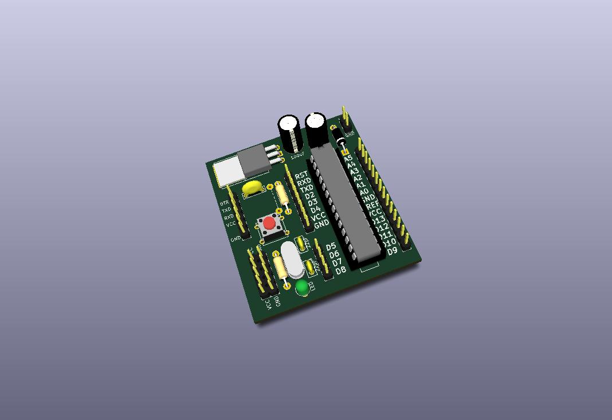
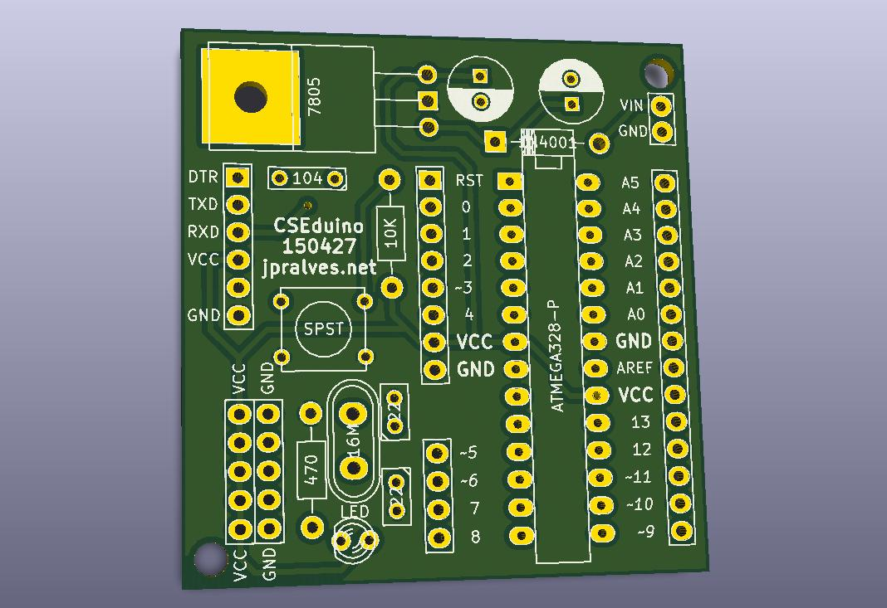
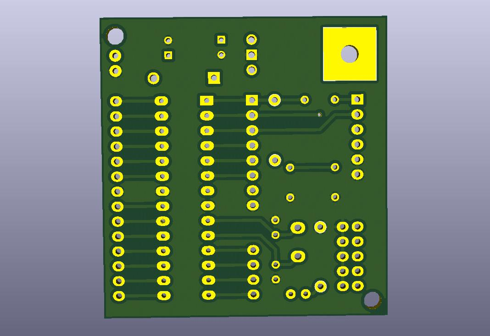

# CSEduino

Build your Arduino from scratch - projects

See more info at http://jpralves.net/cseduino/

This tree is organized in the following way:

- [projects](projects) - projects created with CSEDuino board
- [boards](boards) - Designs of PCB boards for CSEduino v3 and v4 (Kicad Format)
- [workshop](workshop) - Exercises for Workshops

## The V3 Board:

Board with components:

## The v4 Board:

Board with components:

Front of the board:

Back of the board:

